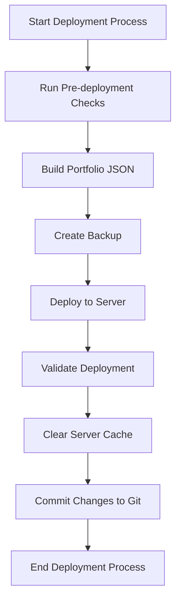

# Website Deployment Guide

This guide explains how to deploy updates to danreisdesign.com and postsforpause.com using the automated deployment scripts.

## Deployment Workflow



## Prerequisites

- SSH access to the server with proper keys configured
- Node.js installed for running build scripts
- Git for version control

## Quick Start

For a standard deployment:

```bash
# Run pre-deployment checks
bash dev/scripts/pre-deploy-check.sh

# Run deployment
bash dev/scripts/deploy.sh
```

## Detailed Steps

### 1. Pre-deployment Checks

The pre-deployment script checks for common issues before deploying:

```bash
bash dev/scripts/pre-deploy-check.sh
```

This performs:
- Portfolio JSON data validation and build
- Directory structure checks
- File presence validation
- Git status check

### 2. Deployment

The main deployment script handles the actual deployment process:

```bash
# Standard deployment
bash dev/scripts/deploy.sh

# Dry run (no changes made)
bash dev/scripts/deploy.sh --dry-run
```

This script performs:
- Building updated portfolio JSON
- Formatting HTML files for consistency
- Creating a backup before deployment
- Updating cache busters in files
- Validating critical files
- Syncing files to the server
- Setting correct permissions
- Clearing server cache
- Opening the sites in browser for verification

### 3. After Deployment

After a successful deployment, don't forget to commit your changes to Git:

```bash
git add .
git commit -m "Deploy site updates on $(date +%Y-%m-%d)"
git push
```

## Troubleshooting

### Common Issues

1. **SSH Connection Failures**

   Check your SSH key configuration:
   ```bash
   ssh-add -l  # List loaded keys
   ssh-add ~/.ssh/id_rsa  # Add your key if needed
   ```

2. **Missing Portfolio Data**

   Regenerate portfolio data manually:
   ```bash
   node dev/scripts/build-portfolio-json.js
   ```

3. **Permissions Issues**

   If files aren't accessible after deployment, check permissions:
   ```bash
   ssh -p 21098 danrtzaq@danreisdesign.com "chmod -R u=rwX,g=rX,o=rX '/home/danrtzaq/public_html'"
   ```

4. **Cache Issues**

   If changes aren't visible, manually clear the server cache:
   ```bash
   ssh -p 21098 danrtzaq@danreisdesign.com "rm -rf /home/danrtzaq/tmp/cache/*"
   ```

## Custom Deployment Options

### Selective Deployment

To deploy only specific directories:

```bash
# Deploy only public_html
bash dev/scripts/deploy.sh public_html

# Deploy only postsforpause.com
bash dev/scripts/deploy.sh postsforpause.com
```

### Backup Management

Backups are stored in `dev/backups/` with timestamps. To restore from backup:

```bash
# List available backups
ls -la dev/backups/

# Restore from a specific backup (replace with actual backup date)
cp -R dev/backups/2023-05-27_14-30-45/public_html/* public_html/
```

## Deployment Log

Deployment logs are stored in `dev/logs/deploy/` for troubleshooting and auditing.

To view the latest deployment log:

```bash
ls -t dev/logs/deploy/ | head -1 | xargs cat
```
